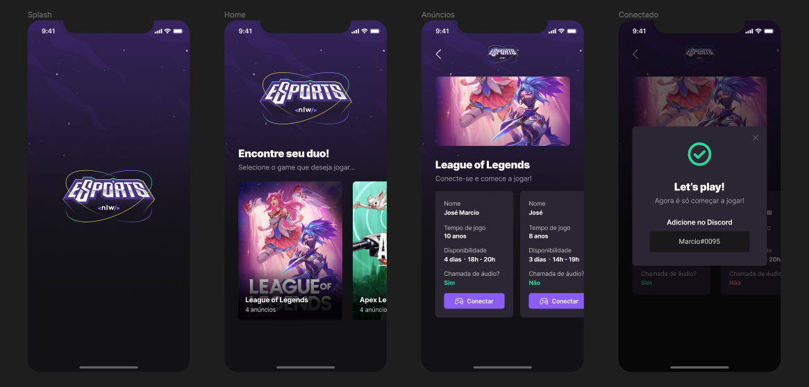
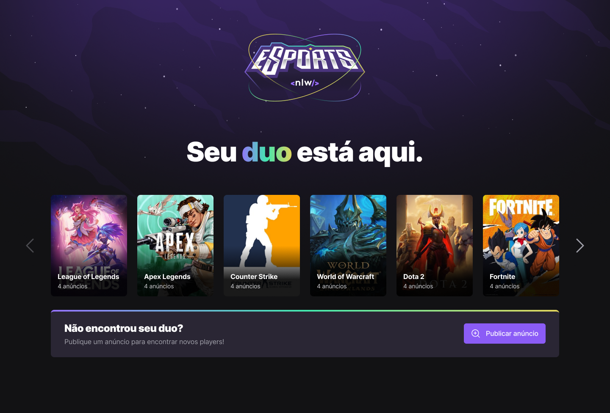
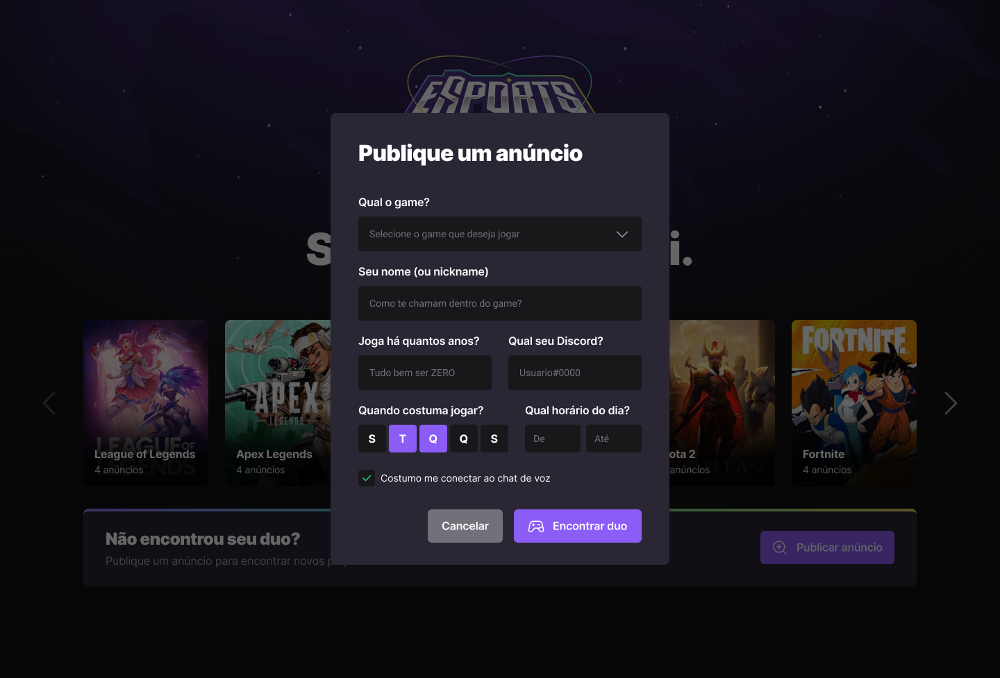

# NLW eSports

<br>
<div align="center">
  
</div>
<br>

## Preview Mobile

<br>

## Preview Web
<div align="center" >
  
  
</div>

<br>


> Trilha Ignite, Projeto construído no evento Next Level Week da Rocketseat Edição eSports. 

<br>

## 💻 Projeto

O projeto se chama Encontre seu Duo. É uma plataforma para encontrar o parceiro perfeito para jogar seu jogo favorito juntos. 🕹️

<br>

## 🛠 Tecnologias

- `React`;
- `React Native`;
- `ViteJS`;
- `Node.js`;
- `Express`;
- `Expo`;
- `Axios`;
- `Hoppscotch`;
- `Prisma`;
- `Figma`;
- `Radix UI`;
- `Phosphor Icons`;
- `Tailwind CSS`;

<br>

## 🕹️ Como Utilizar
Para rodar estas aplicações será necessário, primeiramente escolher a que deseja, entre elas:
- WEB;
- MOBILE.


A aplicação "server" se integra com a "web" e a "mobile", realizando o Back-end. Caso queira rodar as aplicações basta utilizar os seguintes comandos:


Rodando a aplicação web, primeiro iniciar o servidor e depois o próprio "web", ambos com o comando:
```bash
npm run dev
```

Rodando a aplicação mobile, primeiro iniciar o servidor e depois o próprio "mobile":
#### Server
```bash
npm run dev
```
#### Mobile
```bash
expo start --tunnel
ou
expo start 
```

Obs.: não esqueça de trocar pelo IP da sua máquina, para verificar o IP utilize o seguinte comando no terminal e achei o IPv4:
#### windows
```bash
ipconfig
```
#### Linux
```bash
ipconfig
```
<br>

## 💛 Contato

> josemarciob.contato@gmail.com
<br>